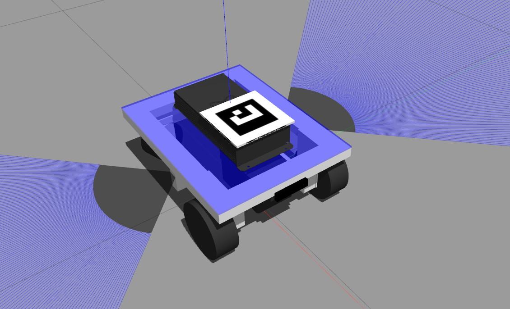

# Fiducial Robot Tracker #

Fiducial marker based robot tracking and visual odometry.


## Aruco detector node

Copyright (c) 2017-20, Ubiquity Robotics Inc., Austin Hendrix

### Parameters ###

- **publish_images** - whether to republish camera stream with re-projected markers
- **fiducial_len** - actual side length of the physical marker (m)
- **do_pose_estimation** - use tf and camera_info to publish fiducial transforms
- **dictionary** - class cv::aruco::Dictionary Dictionary/Set of markers.

```cpp
enum  	cv::aruco::PREDEFINED_DICTIONARY_NAME {
  cv::aruco::DICT_4X4_50 = 0,
  cv::aruco::DICT_4X4_100,
  cv::aruco::DICT_4X4_250,
  cv::aruco::DICT_4X4_1000,
  cv::aruco::DICT_5X5_50,
  cv::aruco::DICT_5X5_100,
  cv::aruco::DICT_5X5_250,
  cv::aruco::DICT_5X5_1000,
  cv::aruco::DICT_6X6_50,
  cv::aruco::DICT_6X6_100,
  cv::aruco::DICT_6X6_250,
  cv::aruco::DICT_6X6_1000,
  cv::aruco::DICT_7X7_50,
  cv::aruco::DICT_7X7_100,
  cv::aruco::DICT_7X7_250,
  cv::aruco::DICT_7X7_1000,
  cv::aruco::DICT_ARUCO_ORIGINAL,
  cv::aruco::DICT_APRILTAG_16h5,
  cv::aruco::DICT_APRILTAG_25h9,
  cv::aruco::DICT_APRILTAG_36h10,
  cv::aruco::DICT_APRILTAG_36h11
}
```

## Tracker node

### Parameters ###
- **robot_id** - ArUco 4x4 marker id, default: 0
- **odom_frame_id** - odom child frame id, default: base_link

### Subscribes ###
- **fiducial_transforms** - filters for selected robot_id

### Publishes ###
- **fiducial_markers** - marker point as visualization message
- **fiducial_tracker/odom** - odometry message

### Service ###
- **/fiducial_tracker/reset_origin** - awaits and returns resetOrigin as bool

## Gazebo material

Helper script is available to add the marker to the robot description:

```xml
<xacro:include filename="$(find ros_fiducial_tracker)/xacro/marker.xacro"/>
<xacro:aruco_marker frame_id="marker" 
                    marker_id="1" 
                    marker_length="0.12" 
                    parent_link="base_link">
    <origin xyz="0.055 0 0.065"
            rpy="0 0 0"/>
</xacro:aruco_marker>
```



## Requirements ##

- [calibrated camera](http://wiki.ros.org/camera_calibration)
- [markers](http://chev.me/arucogen/)

