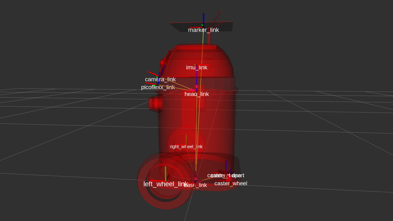

# Fiducial Robot Tracker #

Fiducial marker based robot tracking and odometry.

### URDF ###

### Parameters ###
- **robot_id** - ArUco 4x4 marker id, default: 0
- **odom_frame_id** - odom child frame id, default: base_link

### Subscribes ###
- **fiducial_transforms** - filters for selected robot_id

### Publishes ###
- **fiducial_markers** - marker point as visualization message
- **fiducial_tracker/odom** - odometry message

### Service ###
- **/fiducial_tracker/reset_origin** - awaits and returns resetOrigin as bool

### Requirements ###
- [calibrated camera](http://wiki.ros.org/camera_calibration)
- [aruco_detect](http://wiki.ros.org/aruco_detect)
- [marker](http://chev.me/arucogen/)
